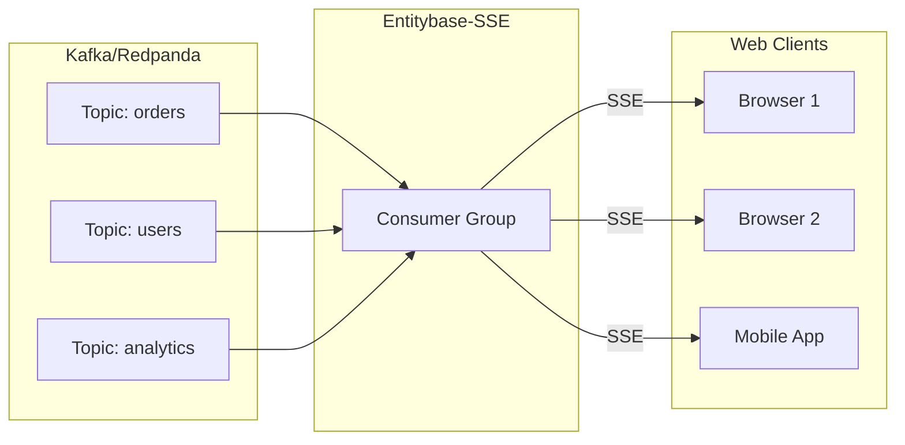

# Entitybase-SSE

**Turn Kafka/Redpanda streams into real-time HTTP feeds your web app can consume.**

Entitybase-SSE bridges your message broker to web browsers. It subscribes to Kafka/Redpanda topics and pushes each message to connected clients over a long-lived HTTP connection using [Server-Sent Events (SSE)](https://html.spec.whatwg.org/multipage/server-sent-events.html). No WebSockets, no polling, just simple push streaming over plain HTTP.

## What is it good for?

- **Real-time dashboards** - Push live data to browsers without page refreshes
- **Live notifications** - Broadcast events to all connected clients instantly  
- **Streaming APIs** - Expose Kafka topics as public HTTP streams
- **Event-driven frontends** - React/Vue/Svelte apps consuming event streams natively



## Quick Start

```bash
# Run with Docker (requires Redpanda at localhost:9092)
make run

# List available streams
curl http://localhost:8081/v1/streams

# Subscribe to a stream
curl -N http://localhost:8081/v1/stream/your-topic
```

For remote servers, replace `localhost` with your server IP.

## API Endpoints

- `GET /v1/streams` - List available topics
- `GET /v1/stream/:topic` - Stream messages from a topic via SSE
- `GET /docs` - OpenAPI documentation

## Docker

```bash
make build   # Build image
make run     # Run container
make stop    # Stop container
make clean   # Remove container and image
```

Requires Redpanda/Kafka at `localhost:9092`.

## Makefile Commands

| Command | Description |
|---------|-------------|
| `make run` | Build and run container |
| `make build` | Build Docker image |
| `make test-docker` | Run integration tests |
| `make logs` | View container logs |
| `make shell` | Open shell in container |

## Environment Variables

- `KAFKA_BROKERS` - Broker address (default: `localhost:9092`)
- `LOG_LEVEL` - trace, debug, info, warn, error (default: `warn`)
