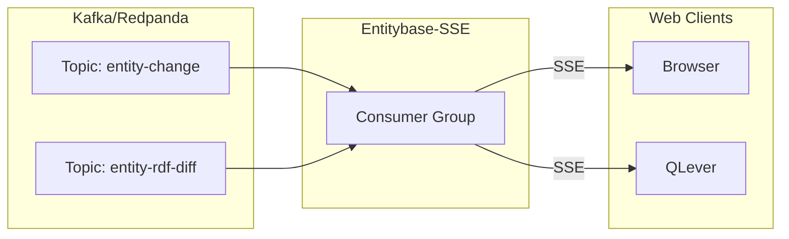

# 🚀 Entitybase-SSE

**Turn Kafka/Redpanda streams into real-time HTTP feeds your web app can consume.**

Entitybase-SSE bridges your message broker to web browsers. It subscribes to Kafka/Redpanda topics and pushes each message to connected clients over a long-lived HTTP connection using [Server-Sent Events (SSE)](https://html.spec.whatwg.org/multipage/server-sent-events.html). No WebSockets, no polling—just simple push streaming over plain HTTP.

## ✨ What is it good for?

- ✅ **Real-time dashboards** — Push live data to browsers without page refreshes
- ✅ **Live notifications** — Broadcast events to all connected clients instantly  
- ✅ **Streaming APIs** — Expose Kafka topics as public HTTP streams
- ✅ **Event-driven frontends** — React/Vue/Svelte apps consuming event streams natively



## ⚡ Quick Start

### Backend

```bash
# Run with Docker (requires Redpanda at localhost:9092)
make backend-run

# List available streams
curl http://localhost:8888/v1/streams

# Subscribe to a stream
curl -N http://localhost:8888/v1/stream/your-topic

# Subscribe starting at specific partition/offset
curl -N 'http://localhost:8888/v1/stream/your-topic?partition=0&offset=100'

# Subscribe starting from a specific timestamp
curl -N 'http://localhost:8888/v1/stream/your-topic?timestamp=1704067200000'
```

> **Note:** This backend API is **not compatible** with the upstream [KafkaSSE](https://github.com/wikimedia/KafkaSSE) project. The API has been simplified for easier use.

### Frontend (Vue 3)

```bash
# Install dependencies
make frontend-install

# Run dev server (with hot reload) on port 8082
make frontend-dev

# Build for production
make frontend-build

# Serve built frontend on port 8082
make frontend-serve
```

For remote servers, replace `localhost` with your server IP.

## 🔌 API Endpoints

- `GET /v1/streams` — List available topics
- `GET /v1/stream/:topic` — Stream messages from a topic via SSE
- `GET /version` — Get server version
- `GET /docs` — OpenAPI documentation

## 🖥️ Frontend

The frontend is a Vue 3 + Vite application located in `frontend/`.

### Features

- Stream selection (single select)
- Real-time message display
- Pretty print JSON toggle
- Pause/Resume streaming
- Copy messages to clipboard
- Message rate display (current + average)
- Dynamic version display from backend

### Commands

```bash
make frontend-install     # Install dependencies
make frontend-dev         # Dev server with hot reload
make frontend-build      # Build for production
make frontend-preview    # Preview built files
make frontend-test-run   # Run tests
make frontend-test       # Run tests with UI
```

## 🐳 Docker (Backend)

```bash
make backend-build       # Build image
make backend-run        # Run container
make backend-stop       # Stop container
make backend-clean      # Remove container and image
```

Requires Redpanda/Kafka at `localhost:9092`.

## 🧪 Testing

### Backend Tests

```bash
make backend-test-local   # Run all tests locally
make backend-test-unit    # Run unit tests only
make backend-test-docker  # Run integration tests with Redpanda
```

### Frontend Tests

```bash
make frontend-test-run    # Run tests in terminal
make frontend-test        # Run tests with UI
```

## ⚙️ Environment Variables

- `KAFKA_BROKERS` — Broker address (default: `localhost:9092`)
- `LOG_LEVEL` — trace, debug, info, warn, error (default: `warn`)

## 🏷️ Versioning

Version is managed in `package.json` (single source of truth). The backend exposes it via `/version` endpoint, and the frontend fetches it dynamically at runtime.

```bash
make release  # Creates release vYYYY.M.D, commits and tags
```

## 📂 Makefile Commands

| Command | Description |
|---------|-------------|
| `make help` | Show all available commands |
| `make backend-run` | Build and run backend container |
| `make backend-build` | Build Docker image |
| `make backend-test-docker` | Run integration tests |
| `make backend-logs` | View container logs |
| `make backend-shell` | Open shell in container |
| `make frontend-dev` | Run frontend dev server on port 8082 |
| `make frontend-build` | Build frontend for production |
| `make frontend-serve` | Build and serve frontend on port 8082 |
| `make frontend-test-run` | Run frontend tests |
| `make release` | Create release |

## 👤 Author

- [Nizo Priskorn](https://github.com/dpriskorn)
- Based on [KafkaSSE](https://github.com/wikimedia/KafkaSSE) by Wikimedia Foundation engineers

## 📜 License

[Apache License 2.0](LICENSE)

## 💜 Thanks

Thanks to the fantastic engineers at the [Wikimedia Foundation (WMF)](https://www.wikimedia.org/) for creating KafkaSSE!

## 📚 For Nerds

- [Implementation Details](docs/IMPLEMENTATION.md) — Deep dive into how it works
- [API Documentation](http://localhost:8888/docs) — OpenAPI specs (when running locally)
- [Architecture Diagram](docs/diagrams/architecture.png) — System architecture
- [Sequence Diagrams](docs/diagrams/) — Connection and loop flows
